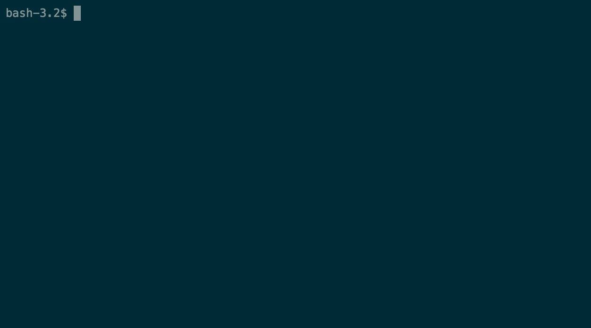

# Проект Brain Games
### Brain Games — это набор из мини-игр, запускаемых из консоли.
*разработка проекта в рамках обучения профессии* [Фронтенд JavaScript программист](https://ru.hexlet.io/professions/frontend)

---

---

### Установка
локально в папку `npm i brain_games_agalar`
или глобально `npm i brain_games_agalar -g`

### Запуск игр
1) `brain-even`

	

2) `brain-calc`

	

3) `brain-gcd`

	

4) `brain-progression`

	

5) `brain-prime`
	
	
